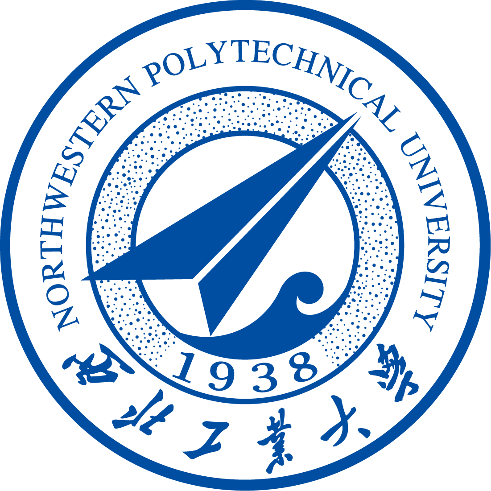

### Hi there 👋

 Hi, I'm Shen Wang! Welcome to my world!

    
  <strong>⚡ Check out my work below! </strong>
    

---

### A Brief Introduction
- 🏫 Shen Wang currently works at the School of Cybersecurity, pursuing his bachelor degree at <a href="https://www.nwpu.edu.cn/">Northwestern Polytechnical University (NWPU).
- 📫 You can get in touch with me by email at [shenwang918@gmail.com](mailto:shenwang918@gmail.com)

---
### 📖 Education Background

  
**Bachelor Degree** \
[**Northwestern Polytechnical University**](https://www.nwpu.edu.cn/) • 2020/09/01 - 2024/07/01 \
Skills: `C/C++`, `Python`, `etc.` \

 
